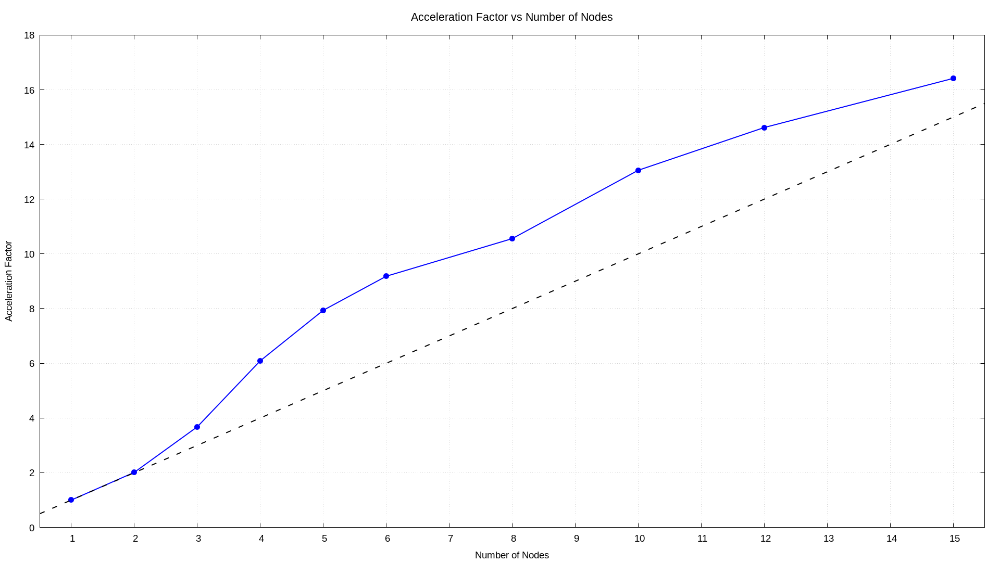

# 2D Poisson's Equation Solver

## Table of Contents
- [Problem Statement](#Problem-Statement)
- [Finite Difference Method](#Finite-Difference-Method)
- [usage](#usage)
- [Scaling with Number of Threads on One Node](#Scaling-with-Number-of-Threads-on-One-Node)

## Problem Statement

This code solves the 2D Poisson's equation:

$$
\frac{\partial^2 u(x,y)}{\partial x^2} + \frac{\partial^2 u(x,y)}{\partial y^2} = f(x,y) \quad \text{in } \Omega = [0,1]^2
$$

with boundary conditions:

$$
u(x,y) = 0 \quad \text{on } \partial \Omega.
$$

where $\partial \Omega$ denotes the boundary of the domain $\Omega$.
The source term $f(x,y)$ is defined as:

$$
f(x,y) = 2 \left(x^2 - x + y^2 - y\right)
$$

## Finite Difference Method

The problem is discretized using a finite difference method on a grid. The domain $\Omega$ is divided into a uniform grid with 
$n_x=n_y=n$ grid points in the $x$ and $y$ directions, respectively.
The finite difference update formula for the solution $u_{i,j}$ at grid point $(i,j) \equiv (x_i=ih, y_i=ih)$ is given by:

$$
u_{i,j}^{(n+1)} = \frac{1}{4} \left(u_{i+1,j}^{(n)} + u_{i-1,j}^{(n)} + u_{i,j+1}^{(n)} + u_{i,j-1}^{(n)}\right) - \frac{h^2}{4} f_{i,j}
$$

where $h=1/(n-1)$ is the spatial discretization step, and $f_{i,j}$ is the value of the source term $f(x,y)$ at grid point $(i,j)$.

This algorithm is also known as the Jacobi method for updating the solution starting from a guess $u^0$.


## Usage

To run the code, follow these steps:

### 1. Source the Environment Setup Script

Before compiling, you need to source the environment setup script to configure your environment properly. 
Run the following command:

```bash
source CJac/config/env.rc
```

### 2. **Navigate to the main directory:**

Change to the directory where the source code is located:

```bash
cd CJac/two_d
```

### 3. **Compile the code to generate the binary:**

To compile the code and generate the binary executable, run the following command:

```bash
make
```

### 4. **Set the parameters in the configuration file:**

Edit the `param.txt` file to set the parameters for the simulation. This file is located in the `CJac/two_d` directory. 
Open it with a text editor and modify the parameters according to your requirements.


### 5. Run the Binary

Execute the compiled binary to start the simulation. Use `mpirun` with the appropriate number of MPI processes:

```bash
mpirun --bind-to none -np <num_processes> ./bin/poisson
```

## Scaling with Number of Cores and Nodes

In this section, we present a test of the code scaling performance on the 
[TURPAN](https://www.mesonet.fr/documentation/user-documentation/arch_exp/turpan/) machine. 
The evaluation was conducted using nodes equipped with Ampere Altra Q80-30 processors, featuring 
80 ARM v8.2 cores running at 3 GHz. The parameters used for this test are `n=4800`, `it_max=10000`, and `it_print=2000`.


### Scaling with Number of Threads

#### Wall Time vs Number of Threads

The plot below shows the variation in wall time as the number of threads increases:


#### Acceleration Factor vs Number of Threads

The following plot illustrates the acceleration factor, demonstrating the performance scaling with an increasing number of threads:


### Scaling with Number of Nodes

#### Wall Time vs Number of Nodes

The plot below shows the variation in wall time as the number of nodes increases:


#### Acceleration Factor vs Number of Nodes

The following plot illustrates the acceleration factor, demonstrating the performance scaling with an increasing number of nodes:




